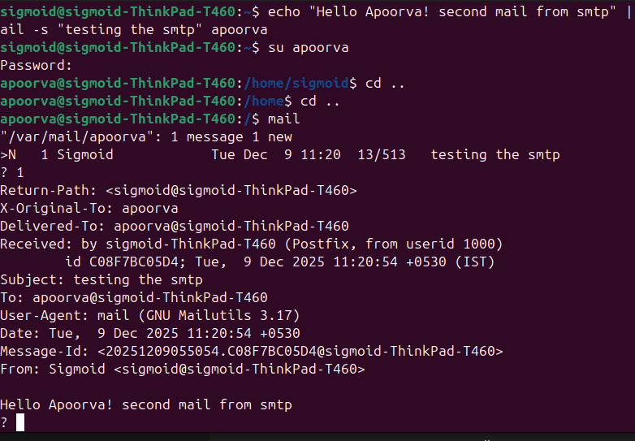
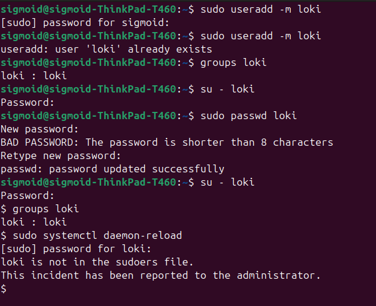
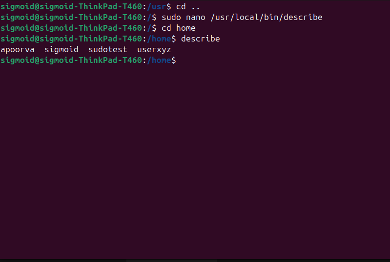
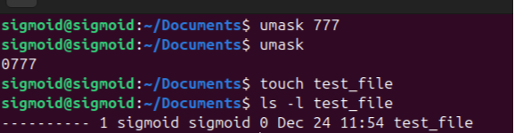
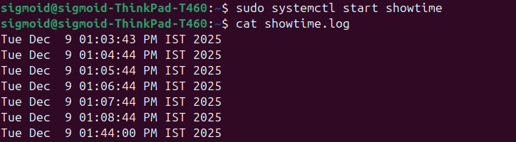

# Linux-assignment-

1.**CONFIGURING SMPT ON LOCAL HOST:**

Steps:
- sudo apt update
- sudo apt install postfix -y
- sudo systemctl start postfix
- sudo systemctl enable postfix
- sudo systemctl status postfix

 screen shots:
 
 
 

2. **CREATING USER WITHOUT SUDO ACCESS**:

steps:
- step1: Create a new user with a home directory.

- step2:Set a password for the new user.

- step3-Check which groups the user belongs to.

- step4:Remove the user from the sudo group
 3. **CREATE DESCRIBE FILE RUN FROM ANYWHERE**:

STEPS:
 - step1:Create a new script file in a directory that is in the system PATH (e.g., /usr/local/bin).

- step2:Write a simple script that lists all files and folders in the current directory (ls).

- step3:Make the script executable.

- step4:Test the command by switching to the new user and running describe from any directory

screen shots:

 
 4. **FIND THE research.file AND UNZIP IT**:
 
 STEPS:
- gunzip research.gz
- bunzip2 research.bz2
- unzip research.zip
- tar -xvzf research.tar.gz

5. **CREATE A FILE WITH NO PERMISSION**:

STEPS:
- STEP1:Opens the /etc/profile file using nano editor.
__sudo nano /etc/profile__

- STEP2:Sets the default permission mask.
777 removes read (4), write (2), execute (1) permissions for
__umask 777__

- **SCREENSHOTS**:

6. **CREATE SHOWTIME SERVICE**:

STEPS:

- step1:
create a showtime shell file :
  
  #!/bin/bash
while true
    
    do
    
    date >> /home/$SUDO_USER/showtime.logs   
leep 60
  
  done
- step 2: change the permission and create a service file
sudo chmod +x /usr/local/bin/showtime.sh
  
  sudo nano /etc/systemd/system/showtime.service
   then the service should have this following code:
     
     [Unit]
  
  Description=Show Time Service

  
  [Service]
  
  ExecStart=/usr/local/bin/showtime.sh
  
  Restart=always

  
  [Install]
  
  WantedBy=multi-user.target

- step 3:now run the service :
  
  sudo systemctl daemon-reload
  
  sudo systemctl start showtime
  
  sudo systemctl stop showtime
  
  sudo systemctl status showtime

- screenshots: 

